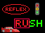
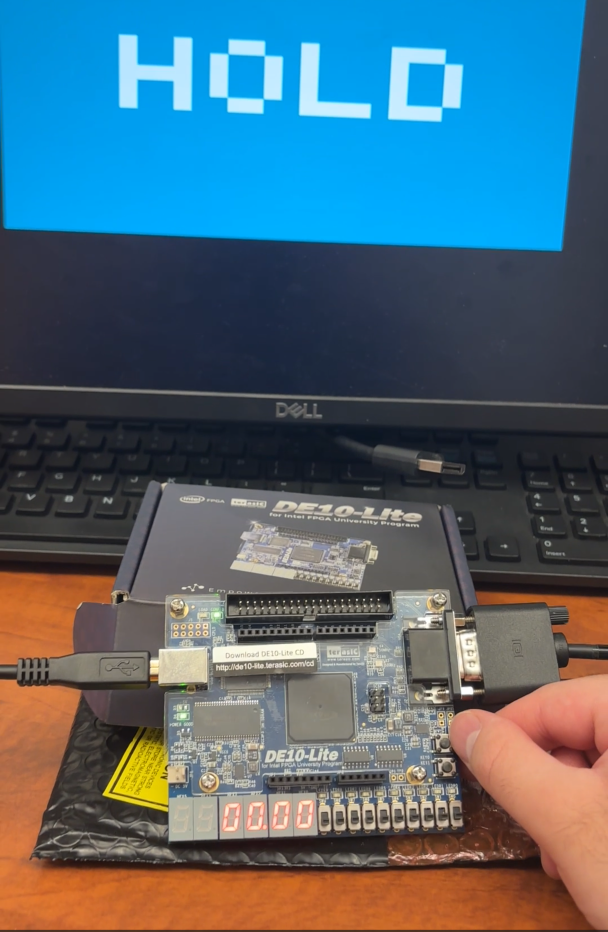

# ReflexRush 🕹️
A reaction-based reflex game implemented in Verilog and designed for the DE10-Lite FPGA board using Quartus Prime.



---
## 🎮 Demo

[](https://drive.google.com/file/d/11i0vkIMxMj5XKZvvz9c_aazylxQ8c4k5/view?usp=sharing)
> Click the image above to watch a demo of ReflexRush on the DE10-Lite FPGA.

## 🎯 Overview

**ReflexRush** is a hardware game that tests user reaction speed using LEDs and buttons on an FPGA board. When the game starts, LEDs light up randomly, and the user must press the corresponding button as fast as possible. Timing and performance are displayed on a 7-segment display.

---

## 🔧 Tech Stack

- 💡 **HDL:** Verilog
- 🛠️ **IDE:** Intel Quartus Prime
- 📟 **Board:** DE10-Lite FPGA
- 📁 **Simulation:** ModelSim 

---

## 📂 Project Structure

```bash
ReflexRush/
├── DE10_LITE_Golden_Top.v          # Top-level design
├── reflex_rush_top.v               # Core game logic
├── tb_lfsr_gen.v                   # Testbench for LFSR module
├── vga_controller.v                # Optional VGA controller
├── images/                         # Screenshots, visuals
├── mem/                            # Memory initialization files
├── simulation/                     # Testbenches
└── README.md                       # You're here :)
